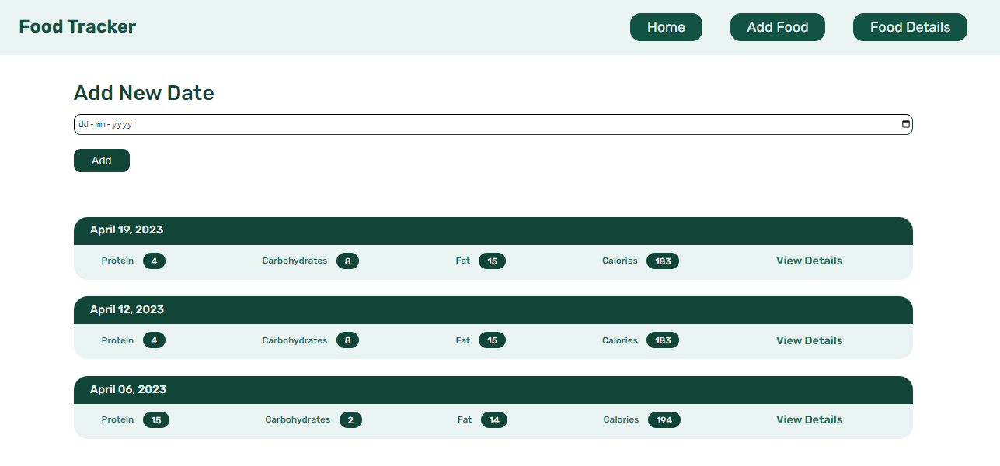
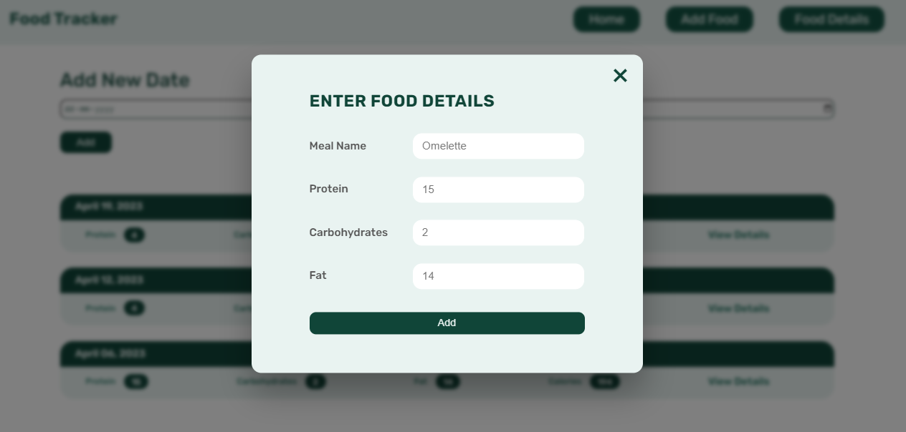
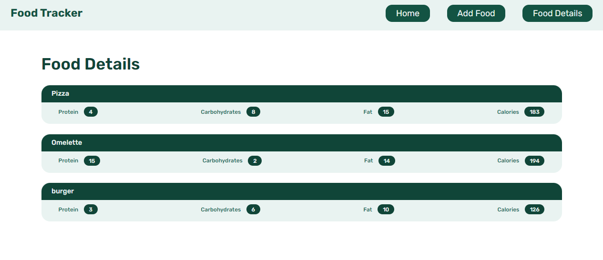
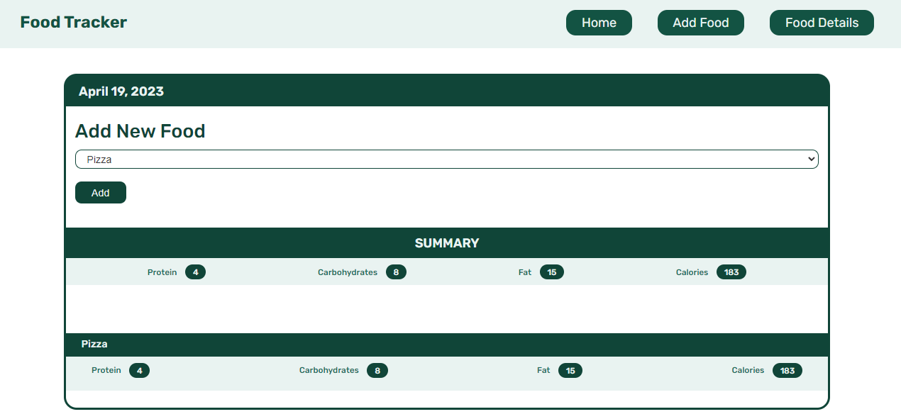

# Food Tracker
This is a simple food tracking application built with Flask and SQLite3, where users can track their daily food intake by adding food items and their respective nutrient information like protein, fat, and carbs.






<h2> Project Structure </h2>

```bash
food tracker/
    static/
        general.css
        script.js
        styles.css
    templates/
        base.html
        foods.html
        home.html
        view.html
    app.py
    database.db
    foodDatabase.sql
```

- `static/`: Contains static files like CSS and JavaScript.
- `templates/`: Contains all HTML templates used in the project.
- `app.py`: Main Flask application file containing all the - routes and logic for the application.
- `database.db`: SQLite database file where all the food and dates information is stored.
- `foodDatabase.sql`: SQL script to create the database and necessary tables.

<br>

## Usage

### 1.  Clone the repo

```bash
git clone https://github.com/Anubhav-Goyal01/Food-Tracker.git
```

### 2. Create the database
```bash
sqlite3 database.db < foodDatabase.sql
```

### 3. Start the flask application
```bash
flask run
```

## Features
The application has the following features:

- Users can add new food items with their respective nutrient information like protein, fat, and carbs.
- Users can view all foods which they added in the past.
- Home page shows a chart with the user's total protein, fat, calories, and carbs consumption for each date.
- Users can also view a particular day's food intake information by clicking on `View Details` button on home page.
